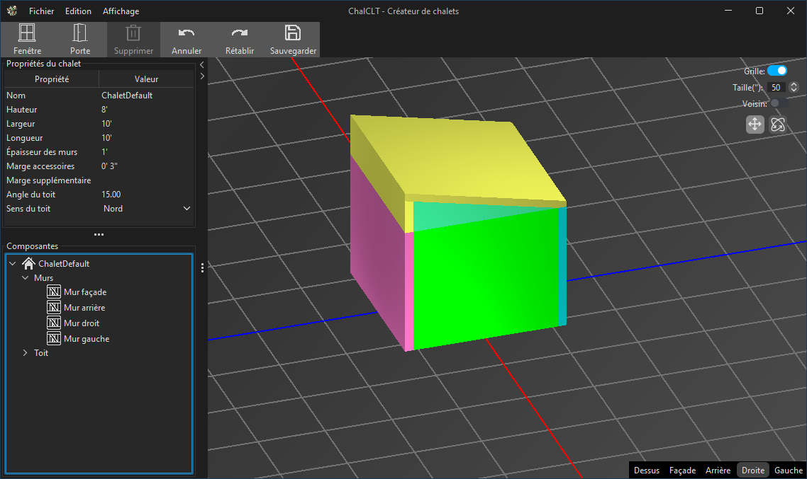
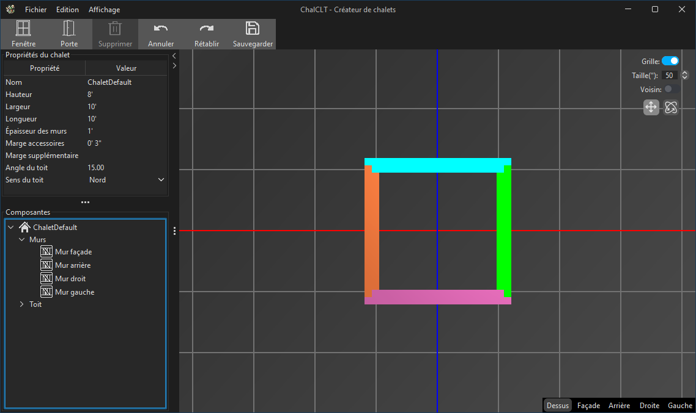
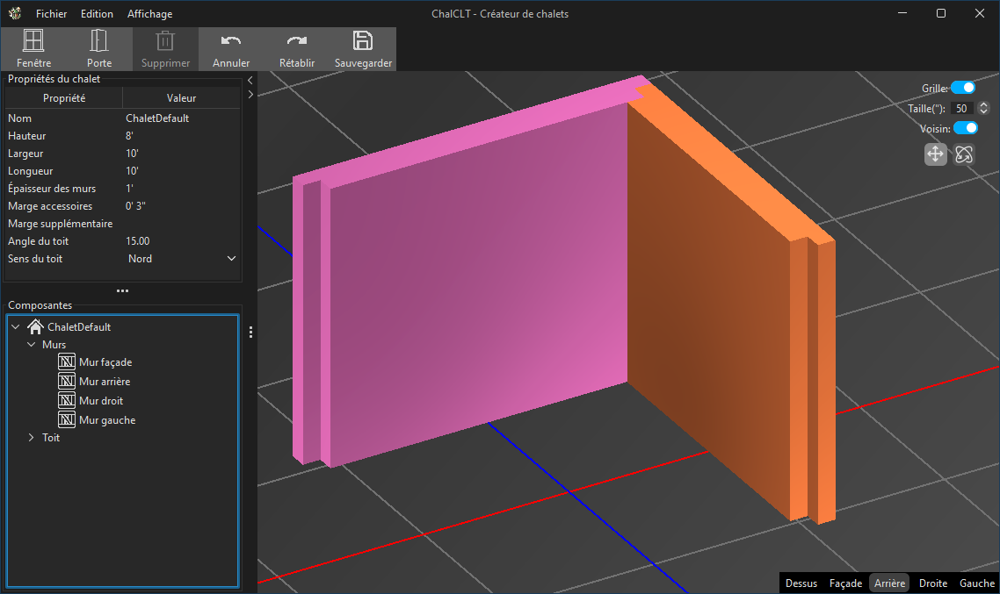
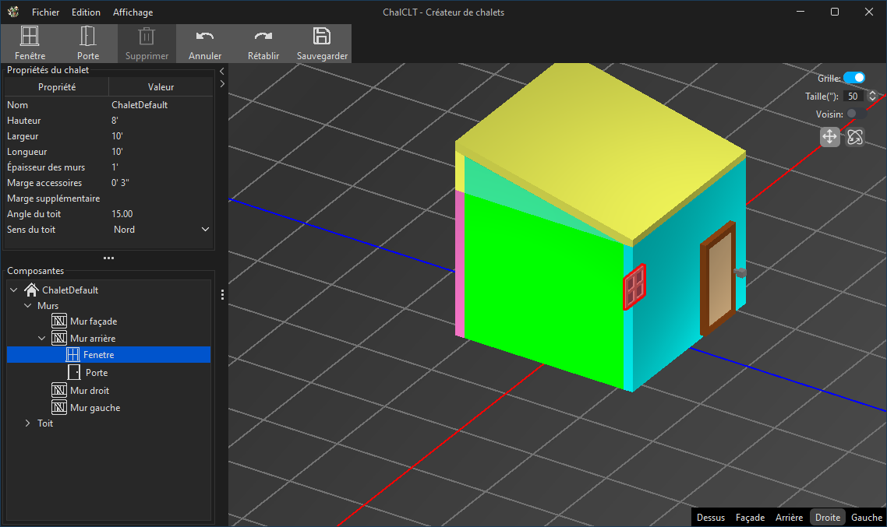

Mise en contexte
> On fait appel à votre équipe pour le développement d’un logiciel (ChalCLT) qui servira à réaliser le design
> de chalets en bois massif lamellé-croisé. Ce projet est inspiré d’une recherche en cours en collaboration
> avec l’entreprise SOKIO, qui a gracieusement accepté de fournir la problématique et les données.
> Les murs en bois massif lamellé-croisé (en anglais, CLT) diffèrent des murs standards puisqu’ils sont
> constitués de bois massifs. Un panneau CLT est composé de 3, 5, 7 ou 9 couches croisées de bois collées
> ensemble.
> Il est à noter qu’on fait l’acquisition de ces panneaux déjà collés/assemblés. Une entreprise de
> construction devra cependant les tailler aux bonnes dimensions, usiner des ouvertures et des rainures,
> de manière à pouvoir les assembler sur le chantier pour former un chalet.
> Le procédé actuel de l’entreprise consiste à faire le design du chalet dans un premier logiciel de design
> 3D (Revit), puis de transférer le design dans un second logiciel (AutoCAD) afin de générer les plans de
> découpage des différents panneaux. Malheureusement, le transfert d’un logiciel à l’autre implique un
> processus technique de reconception pour chaque mur ainsi que le toit – ce qui est un processus lent et
> fastidieux.
> Votre mission, si vous l’acceptez, consiste à produire un logiciel combinant les fonctionnalités des deux
> logiciels. Votre logiciel devra être en mesure d’informatiser le processus de design des quatre côtés
> (façade, arrière, gauche et droit) ainsi que le toit d’un chalet. Par la suite, il sera possible d’exporter
> automatiquement les différents panneaux en format STL.
>
> [Plus d'information](2023A_Projet_session.pdf)

## Contribution

## Résultats

## Compétences

</img>
</img>
</img>
</img>
